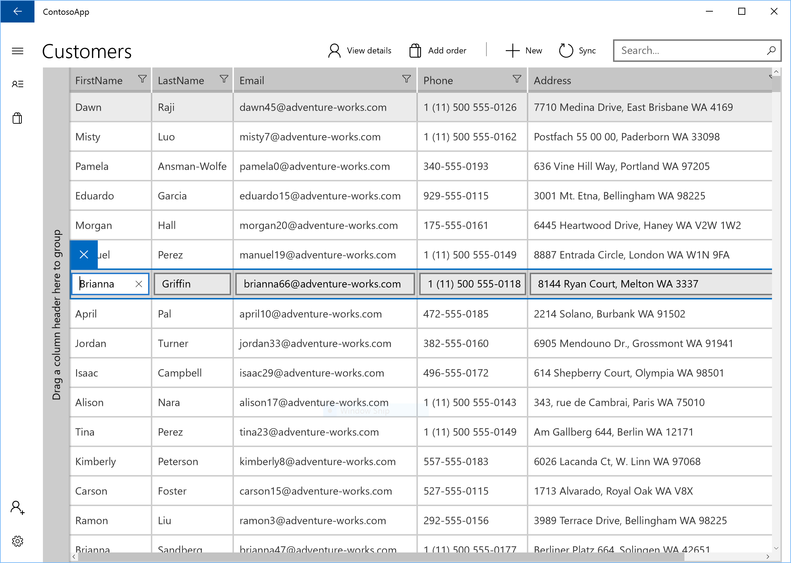

<!---
  category: ControlsLayoutAndText Data IdentitySecurityAndEncryption Navigation NetworkingAndWebServices
-->

# Customers Orders Database sample 

A mini-app sample that shows common enterprise scenarios such as creating and maintaining customer accounts, orders, and products. 
This sample runs on the Universal Windows Platform (UWP). 

The app showcases features useful to enterprise developers, like user authentication, UI controls, and cloud database integration.

## Features

This sample highlights: 

- The master/details UI pattern
- An editable DataGrid with input validation
- Form layouts
- Authenticating and obtaining user info using Azure Active Directory (AAD)
- Connecting to an external data source

## Run the sample

This sample is designed to connect to an instance of Azure Active Directory for authentication and an external service for data. To get you started right away, we're providing a live test service you can connect to out of the box. However, in order to debug and explore the full functionality of the app, you'll need to deploy your own instance to Azure.

### Quick start 

### Prepare your environment

This sample requires Visual Studio 2015 with Update 3, the Windows 10 Software Development Kit (SDK), and .NET Core SDK.

* [Get a free copy of Visual Studio 2015 Community Edition with support for building Universal Windows apps](http://go.microsoft.com/fwlink/?LinkID=280676)
* [Get the .NET Core SDK and Visual Studio 2015 Update 3](https://www.microsoft.com/net/core)

Additionally, to receive the latest updates to Windows and the development tools, and to help shape their development, join the [Windows Insider Program](https://insider.windows.com/ "Become a Windows Insider").

### Run

Set your startup project as **Yodo1APICaller**, then press F5 to run.

### Complete setup

To fully explore the sample, you'll need to connect to your own Azure Active Directory and data source. Here's the steps you'll need to take:  

- Set your client Id: Set the *AccountClientId* field in [AuthenticationViewModel.cs](Yodo1APICaller/ViewModels/AuthenticationViewModel.cs#55) to your Azure account client Id.
- Set the API endpoint: In [ApiHelper.cs](ContosoModels/Database/ApiHelper.cs#44), set the value of the *BaseUrl* constant to match the url the backing service is running on.
- Set a database connection string: In [ContosoContext.cs](ContosoService/ContosoContext.cs#39), set the connection string to one of your own local or remote databases.
- Associate this sample with the Store: Authentication requires store association. To associate the app with the Store, right click the project in Visual Studio and select **Store** -> **Associate App with the Store**. Then follow the instructions in the wizard.

You can then either start the service running locally, or deploy it to Azure. 

- To run locally, right-click the solution, choose *Properties*, and choose to start both **Yodo1APICaller** and **ContosoService** at the same time. 
- To deploy to Azure, right-click ContosoService, choose *Publish*, and then follow the steps in the wizard.

## Code at a glance

If you're only interested in specific tasks and don't want to browse or run the entire sample, check out some of these files: 

- Authentication, user info, and Microsoft Graph: [AuthenticationControl.xaml](Yodo1APICaller/UserControls/AuthenticationControl.xaml) and [AuthenticationViewModel.cs](Yodo1APICaller/ViewModels/AuthenticationViewModel.cs)
- App shell and navigation menu: [AppShell.xaml](Yodo1APICaller/AppShell.xaml), [NavMenuItem.cs](Yodo1APICaller/Navigation/NavMenuItem.cs), and [NavMenuListView.cs](Yodo1APICaller/Navigation/NavMenuListView.cs)
- Master/details and form layouts UI: [CustomerListPage.xaml](Yodo1APICaller/Views/CustomerListPage.xaml), [CustomerListPageViewModel.cs](Yodo1APICaller/ViewModels/CustomerListPageViewModel.cs), [CustomerDetailPage.xaml](Yodo1APICaller/Views/CustomerDetailPage.xaml), [CustomerDetailPageViewModel.cs](Yodo1APICaller/ViewModels/CustomerDetailsPageViewModel.cs), [OrderListPage.xaml](Yodo1APICaller/Views/OrderListPage.xaml), [OrderListPageViewModel.cs](Yodo1APICaller/ViewModels/OrderListPageViewModel.cs), [OrderDetailPage.xaml](Yodo1APICaller/Views/OrderDetailPage.xaml), [OrderDetailPageViewModel.cs](Yodo1APICaller/ViewModels/OrderDetailPageViewModel.cs)
- Database and REST API calls: [ContosoDataSource.cs](ContosoModels/Database/ContosoDataSource.cs), [ApiHelper.cs](ContosoModels/Database/ApiHelper.cs), [CustomerController.cs](ContosoService/Controllers/CustomerController.cs), [OrderController.cs](ContosoService/Controllers/OrderController.cs), [ProductController.cs](ContosoService/Controllers/ProductController.cs)

## Design patterns

### Master/details

This sample demonstrates several flavors of the master/details pattern (side-by-side and stacked). The Customers list screen displays a customer list and a details overlay that lets the user view and edit a subset of customer data. The user can double-click to go to the full customer details screen, which shows additional data (such as the list of invoices associated with selected customer). 

The Orders list screen displays a list of orders. It uses visual state triggers to selectively display an additional details panel when the screen is large enough. To see the full details of an order or to edit it, the user double-clicks or selects "Edit" to go to the Order details screen. The Order details screen shows all the info for the order and enables editing. The user can search for additional products to add to the invoice.

### Form layouts

The two details screens show how to use headings, labels, and whitespace to organize controls into a form layout. Some controls used include:

- Layout controls: [Grid](https://msdn.microsoft.com/library/windows/apps/Windows.UI.Xaml.Controls.Grid), [RelativePanel](https://msdn.microsoft.com/library/windows/apps/Windows.UI.Xaml.Controls.RelativePanel), [StackPanel](https://msdn.microsoft.com/library/windows/apps/Windows.UI.Xaml.Controls.StackPanel)
- Data controls: [Telerik RadDataGrid](http://docs.telerik.com/devtools/universal-windows-platform/controls/raddatagrid/columns/datagrid-overview), [ListView](https://msdn.microsoft.com/library/windows/apps/Windows.UI.Xaml.Controls.ListView), [AutoSuggestBox](https://msdn.microsoft.com/library/windows/apps/Windows.UI.Xaml.Controls.AutoSuggestBox)
- Other controls: [Button](https://msdn.microsoft.com/library/windows/apps/Windows.UI.Xaml.Controls.Button), [HyperlinkButton](https://msdn.microsoft.com/library/windows/apps/Windows.UI.Xaml.Controls.HyperlinkButton), [context menu](https://msdn.microsoft.com/windows/uwp/controls-and-patterns/menus)

### Telerik RadDataGrid with data validation

This sample includes a Data Grid from Telerik's newly open-sourced UI for UWP controls library. You can find the source for these controls on [GitHub](https://github.com/telerik/UI-For-UWP), as well as a package on [NuGet](https://www.nuget.org/packages/Telerik.UI.for.UniversalWindowsPlatform). For help getting started, consult the [Telerik documentation](http://docs.telerik.com/devtools/universal-windows-platform/). 

### Adaptive layouts

This sample demonstrates how to use visual states to adapt the UI for screen sizes varying from a 5 inch phone to a large desktop display. It also supports [Continuum for Phones](https://www.microsoft.com/windows/continuum), so you can use the app running on your Windows 10 phone on your Windows 10 PC. The app supports all versions of Windows 10, but new features are available on the latest versions. For example, the labels on command bar buttons are shown to the right of the icon on Windows 10, version 1607, but they are below the icon on previous versions of Windows 10.

## Known issues

* Data validation for non-US international phone numbers is not working correctly; the numbers will always show as invalid. This issue will be fixed in a future release.

## See also

- [Web account manager](https://msdn.microsoft.com/windows/uwp/security/web-account-manager)
- [Microsoft Graph](https://graph.microsoft.io/)
- [Http client](https://msdn.microsoft.com/windows/uwp/networking/httpclient)
- [Screen sizes and breakpoints](https://msdn.microsoft.com/windows/uwp/layout/screen-sizes-and-breakpoints-for-responsive-design)
- [Define layouts with XAML](https://msdn.microsoft.com/windows/uwp/layout/layouts-with-xaml)
- [Master/details pattern](https://msdn.microsoft.com/en-us/windows/uwp/controls-and-patterns/master-details)